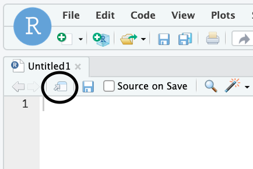
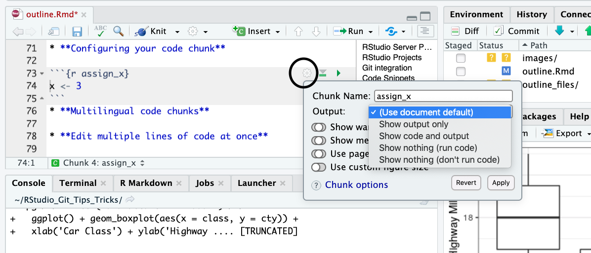
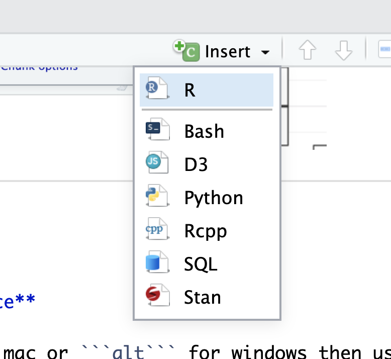
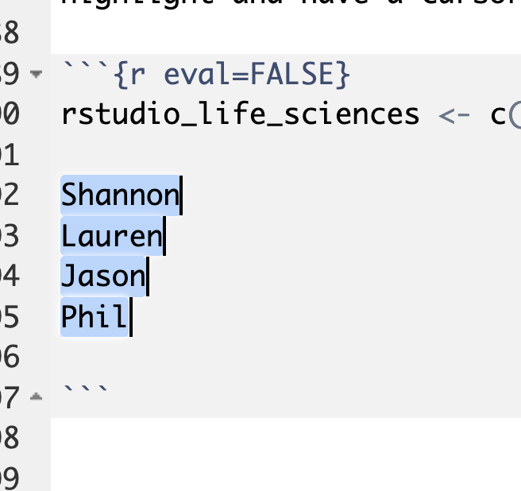
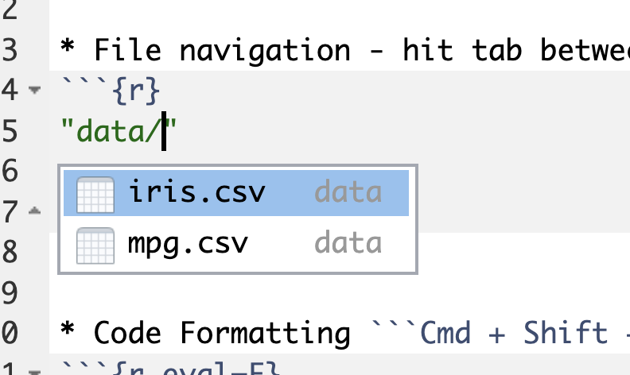
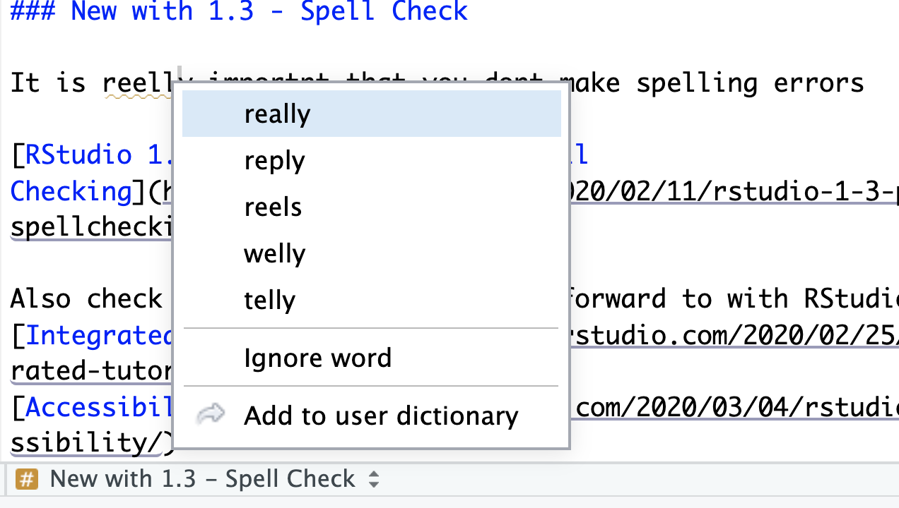

```{r include=FALSE}
library(usethis)
library(tidyverse)
knitr::opts_chunk$set(fig.width=6, fig.height=4) 
```

### RStudio Server Pro Features
* Multiple R sessions
* Multiple Versions of R 

### RStudio Projects

RStudio Projects are a great way to keep all files related to a project together in a common directory/environment/workspace.  

[Using Projects in RStudio](https://support.rstudio.com/hc/en-us/articles/200526207-Using-Projects)

### Git integration

**The best source on using Git with R: ** 
[Happy Git with R](https://happygitwithr.com/)

```{r eval=FALSE}
library(usethis)

# A sampling of the useful functions from usethis to get started
?use_git_config()

?use_git()

?use_github()

?browse_github_token() 

?use_project() 
```
  
   
### Code Snippets

Code snippets allow you to quickly insert common snippets of code!
Just pause or hit tab after typing character sequence for snippet.

**In R**
```{r}
#create a function by typing 'fun' and selecting the snippet
name <- function(variables) {
  
}
#When did we do this? get a time stamp by typing ts and selecting the snippet
# Thu Mar  5 18:19:17 2020 ------------------------------

```
....but also in other languages like python, C, SQL, Stan

**You can create custom snippets!**
Tools > Global Options > Code > Edit Snippets

[RStudio Code Snippets](https://support.rstudio.com/hc/en-us/articles/204463668-Code-Snippets?version=1.3.842&mode=desktop)
  
  
  
## Tips and Tricks
* **Tearable panes**  

Pop out source files to have standalone windows. I find this especially useful when making a shiny app and you have a ui.R and a server.R you want to see side-by-side
  


* **Access the terminal from RStudio**  
  
It's a tab in the same panel as the console

* **Configuring your code chunk**  
  
Easily change the default chunk settings. For example you may want to run the chunk but not show the output or the code (like your setup chunk) in your final report.
  


* **Multilingual code chunks**
You can have code chunks in an Rmd from multiple languages, just click the arrow at the top of the console next to the button to insert a code chunk.



* **Edit multiple lines of code at once** 

Press and hold ```Opt```if you have a mac or ```alt``` for windows then use the cursor to highlight and have a cursor multiple lines of text.  

I can quote these multiple lines of text in one step!

```{r eval=FALSE}
rstudio_life_sciences <- c()

Shannon 
Lauren
Jason
Phil

```




* **Rename in scope -** highlight variable name then Code > Rename in Scope


```{r}
#if you highlight variable name here and use Rename in scope
virginica <- iris %>% filter(Species=='virginica') 

# it will also change here
ggplot(virginica)+geom_point(aes(x=Petal.Length, y=Petal.Width)) 
```


* **Get Command history** - use ```Ctrl / Cmd + ↑``` or open the history tab in the top right of panel

* **File navigation** - hit tab between two quotes also ```Cmd + .``` for fuzzy matching  
  


* **Code Formatting** use ```Cmd + Shift + A```
```{r eval=F}
# Before

mpg%>%filter(manufacturer == 'audi') %>%
  ggplot() +geom_boxplot(aes(x = class, y = cty)) +
  xlab('Car Class') + ylab('Highway Mileage') +theme_bw()

# After

mpg %>% filter(manufacturer == 'audi') %>%
  ggplot() + geom_boxplot(aes(x = class, y = cty)) +
  xlab('Car Class') + ylab('Highway Mileage') + theme_bw()

```

* **Extract a variable**
Code > Extract Variable 
```{r eval=F}
# Before (highlight 'audi' and extract variable)
mpg %>% filter(manufacturer == 'audi') %>%
  ggplot(mpg) + geom_boxplot(aes(x = class, y = cty)) +
  xlab('Car Class') + ylab('Highway Mileage') + theme_bw()

# After
car_type <- audi
mpg %>% filter(manufacturer == car_type) %>%
  ggplot(mpg) + geom_boxplot(aes(x = class, y = cty)) +
  xlab('Car Class') + ylab('Highway Mileage') + theme_bw()
```

* **Extract function**
Code > Extract Function
```{r eval=F}
# Before (highlight both lines & extract function)
y <- x + 2
y * 33

# After
math <- function(x) {
  y<-x+2
  y * 33
} 

```

### Favorite Shortcuts

* ```Alt + (-)``` to insert the assignment operator ``` <- ```
* ``` ctrl + shift + 1```` to maximize focus on source editor
* ``` ctrl + . ``` to navigate files, allowing fuzzy matching!
* ``` Ctrl + P``` to jump to braces 
* ```option + Shift + K``` to show all your shortcuts or go to Tools > Keyboard Shortcuts help
* Also you can modify your own! Go to Tools > Modify Keyboard Shortcuts


### New with 1.3 - Spell Check

It is really important that you don't make spelling errors

[Real time spell check in RStudio 1.3](https://blog.rstudio.com/2020/02/11/rstudio-1-3-preview-real-time-spellchecking/)
  
  
Also check out other things to look forward to with RStudio 1.3: 
[Integrated Tutorials](https://blog.rstudio.com/2020/02/25/rstudio-1-3-integrated-tutorials/)  
  
[Accessibility](https://blog.rstudio.com/2020/03/04/rstudio-1-3-preview-accessibility/)


[RStudio 1.3 Preview - Real Time Spell Checking](https://blog.rstudio.com/2020/02/11/rstudio-1-3-preview-real-time-spellchecking/)